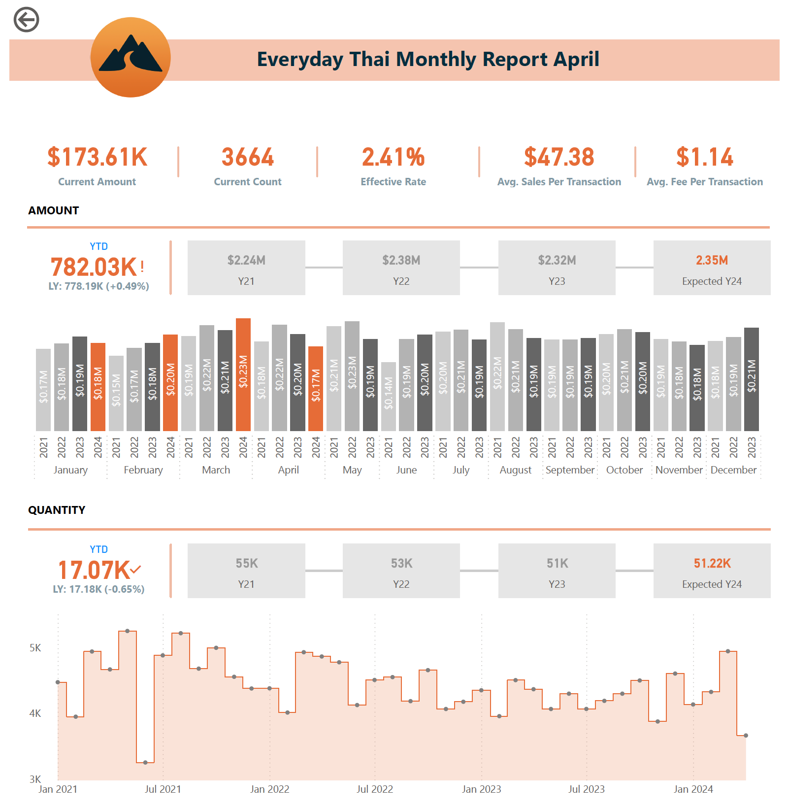
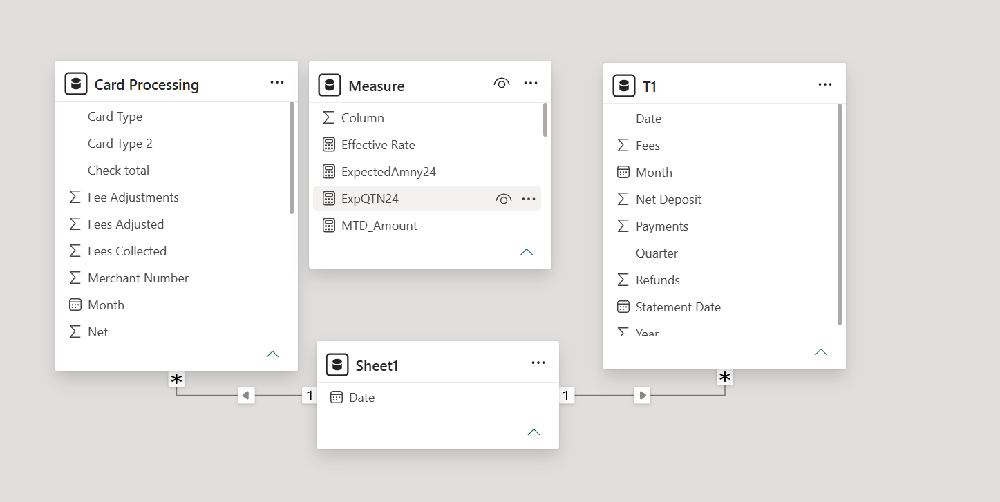

# Everyday Thai – Card Processing Monthly Report (Power BI)

An interactive Power BI dashboard that tracks credit card processing performance for a restaurant business (**Everyday Thai**). It turns monthly merchant-statement data into a one-page report covering sales volume, transaction counts, processing fees and the **effective rate** the business actually pays.

The current report covers **October 2021 – April 2024** (April 2024 is the reporting month).

---

## Dashboard Preview

### Report Page


### Data Model


---

## Business Questions Answered

- How much did we process this month, and how does the year-to-date compare with last year?
- Are we on track for the full year (expected 2024 totals vs. 2021–2023)?
- How many transactions are we processing, and is volume trending up or down?
- What is our effective processing rate, and is it improving?
- Which card types (V/MC/D, Amex, swiped vs. keyed) cost us the most?

---

## Dashboard Contents

### KPI Cards (Current Month – April 2024)
| KPI | Value |
|---|---|
| Current Amount (MTD) | $173.61K |
| Current Count (MTD) | 3,664 transactions |
| Effective Rate | 2.41% |
| Avg. Sales per Transaction | $47.38 |
| Avg. Fee per Transaction | $1.14 |

### Sections
1. **Amount** – YTD sales (782.03K, +0.49% vs. last year), full-year totals for 2021–2023 ($2.24M / $2.38M / $2.32M) and an **Expected 2024** projection ($2.35M). A clustered column chart compares each month across 2021–2024, with 2024 highlighted.
2. **Quantity** – YTD transaction count (17.07K, -0.65% vs. LY), yearly totals (55K / 53K / 51K), expected 2024 (51.22K) and a stepped area chart of monthly volume since Jan 2021.
3. **Fee** – YTD fees ($18.85K, +2.17% vs. LY) with a monthly line chart and trend line.
4. **Effective Rate** – monthly effective rate for 2024 (2.40%–2.42%) with trend line.
5. **Card breakdown table** – payments ($), payments (#), fees collected, refunds and effective rate per card type:

| Card | Effective Rate |
|---|---|
| V/MC/D | 2.34% |
| V/MC/D Swipe | 2.28% |
| V/MC/D (Keyed) | 3.69% |
| Amex | 3.57% |
| Amex Swipe | 3.56% |
| Amex (Keyed) | 4.18% |

**Key insight:** keyed-in transactions are far more expensive than swiped ones (3.69% vs. 2.28% for V/MC/D), so shifting keyed volume to swipe/tap is the clearest way to reduce fees.

---

## Data Model

Star-style model with a shared date table:

```
            Sheet1 (Date)
             1 /      \ 1
              /        \
             *          *
     Card Processing     T1
```

| Table | Purpose |
|---|---|
| **Card Processing** | Fact table (159 rows) – one row per statement month per card type. Columns include Merchant Number, Statement Date, Card Type, Card Type 2 (cleaned label), Rate, Payments (#), Payments ($), Refunds (#), Refunds ($), Fees Collected, Fee Adjustments, Fees Adjusted, Net, Month, Check total. |
| **T1** | Monthly summary fact table – Date, Statement Date, Month, Quarter, Year, Payments, Refunds, Fees, Net Deposit. |
| **Sheet1** | Date dimension used to filter both fact tables. Relationships are one-to-many (single direction) on `Date`. |
| **Measure** | Holds the DAX measures, including `Effective Rate`, `MTD_Amount`, `ExpectedAmny24` and `ExpQTN24`. |

### Key Metric Definitions
- **Effective Rate** = Fees Collected ÷ Payments ($)
- **Avg. Sales per Transaction** = Payments ($) ÷ Payments (#)
- **Avg. Fee per Transaction** = Fees Collected ÷ Payments (#)
- **Expected Y24** = projected full-year 2024 amount / quantity (`ExpectedAmny24`, `ExpQTN24`)

### Source Rate Structure (from the data)
| Card Type | Rate |
|---|---|
| V/MC/D | 1.95% + $0.15 |
| V/MC/D (Keyed) | 3.2% + $0.15 |
| Amex | 3.29% + $0.15 |

---

## Repository Structure

```
├── Everyday Thai Till April 2024 Updated.pbix   # Power BI report (data model, DAX, visuals)
├── Dashboard.pdf                                # Exported dashboard (PDF)
├── images/
│   ├── dashboard.png                            # Dashboard screenshot
│   └── data_model.png                           # Data model / relationships screenshot
└── README.md
```

---

## How to Use

1. Install [Power BI Desktop](https://powerbi.microsoft.com/desktop/) (free, Windows).
2. Clone this repository:
   ```bash
   git clone https://github.com/<your-username>/<repo-name>.git
   ```
3. Open `Everyday Thai Till April 2024 Updated.pbix`. A static copy of the report is also available in [`Dashboard.pdf`](Dashboard.pdf).
4. If the data source path has changed, go to **Home → Transform data → Data source settings** and point it to your local file.
5. To update for a new month, add the new statement rows to the source and click **Refresh**.

---

## Skills Demonstrated

- Data modelling (fact tables, date dimension, one-to-many relationships)
- DAX measures (MTD, YTD, prior-year comparison, forecasting)
- KPI cards, trend lines, conditional highlighting and drill-friendly visuals
- Financial analysis of payment-processing costs

---


## Author

**<Your Name>** – [LinkedIn](https://linkedin.com/in/your-profile) · [GitHub](https://github.com/your-username)
